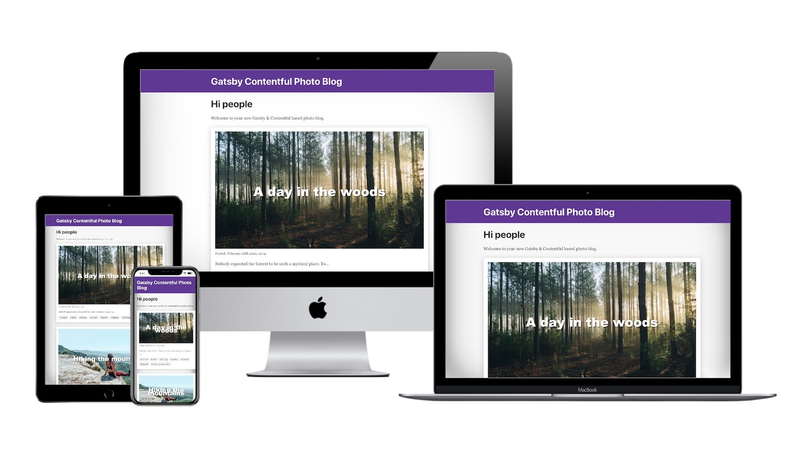

# Gatsby Contentful Photo Blog

> Set up your personal photo blog with markdown, hashtags and pagination with Gatsby & Contentful



You need a [free Contentful account](https://www.contentful.com/sign-up/) to get started.

# Step 0 - Preparation

1. We will use environment variables to securily store and pass our connection credentials. These will to enable us to use Contentfuls preview feature while development and Contentfuls regular API for production.
1. Install dotenv: `npm i dotenv`
2. Add this to the top of your `gatsby-config.js`

```js
const activeEnv = process.env.GATSBY_ACTIVE_ENV || process.env.NODE_ENV || "development"

console.log(`Using environment config: '${activeEnv}'`)

require("dotenv").config({
  path: `.env.${activeEnv}`,
})
```

# Step 1 - Connect to contentful

1. Create new content delivery tokens via `https://app.contentful.com/spaces/YOUR_SPACE_ID/api/keys`
1. Install our source plugin: `npm i gatsby-source-contentful`
1. Duplicate `.env.example` to `.env.development` & `.env.production`
1. Adjust these files .env files:
   * Both should contain your `Space ID`
   * `.env.development` should use your `Content Preview API - access token`
   * `.env.development` uncomment the line that sets the host to `https://cpa.contentful.com`
   * `.env.production` should use your `Content Delivery API - access token`
1. Enable the `gatsby-source-contentful` plugin in your `gatsby-config.js`

```js
{
  resolve: `gatsby-source-contentful`,
  options: {
    spaceId: process.env.SPACE_ID,
    accessToken: process.env.CONTENTFUL_ACCESS_TOKEN,
    host: process.env.CONTENTFUL_HOST,
    environment: process.env.CONTENTFUL_ENVIRONMENT || "master",
  },
},
```

## Step 1b - Starting the server and executing our first GraphQL query.

1. Execute `npm start` and visit `htt`
2. Run your first GraphQL query to see all the posts you just added to Contentful:

```graphql
query MyQuery {
  allContentfulPost {
    nodes {
      title
      slug
      image {
        file {
          fileName
        }
      }
      body {
        body
      }
      hashtags
    }
  }
}
```

In the next step we are going to render these posts on the home page.

# Step 2 - Render posts on home

1. Add a page query to `src/pages/index.js` and render the results:

```diff
 import React from "react"
+import { graphql } from "gatsby"

 import Layout from "../components/layout"
 import SEO from "../components/seo"
+import PostTeaser from "../components/post-teaser"

-const IndexPage = () => (
-  <Layout>
-    <SEO title="Home" />
-    <h1>Hi people</h1>
-    <p>Welcome to your new Gatsby &amp; Contentful based photo blog.</p>
-  </Layout>
-)
+import * as styles from "./index.module.css"
+
+const IndexPage = ({ data }) => {
+  const posts = data.allContentfulPost.nodes
+
+  return (
+    <Layout>
+      <SEO title="Home" />
+      <h1>Hi people</h1>
+      <p>Welcome to your new Gatsby &amp; Contentful based photo blog.</p>
+      <div className={styles.postsWrapper}>
+        {posts.map(post => (
+          <PostTeaser post={post} key={post.slug} />
+        ))}
+      </div>
+    </Layout>
+  )
+}

 export default IndexPage
+
+export const query = graphql`
+  query IndexQuery {
+    allContentfulPost {
+      nodes {
+        title
+        slug
+        image {
+          file {
+            url
+          }
+        }
+        body {
+          body
+        }
+        hashtags
+        createdAt(formatString: "MMMM Do YYYY, H:mm")
+      }
+    }
+  }
+`
```

## Step 2b - Load fitting image based on viewport

Render multiple variants of the post images with Contentfuls Image API and the freshly released `gatsby-plugin-image`:

1. Execute: `npm i gatsby-plugin-image`
2. Add `gatsby-plugin-image` to the plugins in your `gatsby-config.js`
3. Adjust the query in `src/pages/index.js` to tell Gatsby to generate multiple variants of our post images:

```diff
         title
         slug
         image {
-          file {
-            url
-          }
+          gatsbyImageData(
+            aspectRatio: 1.778
+            cropFocus: CENTER
+            layout: CONSTRAINED
+            resizingBehavior: FILL
+            placeholder: BLURRED
+          )
         }
```

4. Adjust rendering in `src/components/post-teaser.js`:
```diff
 import React from "react"
+import { GatsbyImage } from "gatsby-plugin-image"

 import Hashtag from "./hashtag"
 import * as styles from "./post-teaser.module.css"
```
```diff
   return (
     <div className={styles.wrapper}>
       <figure className={styles.figure}>
-        
+        <GatsbyImage image={post.image.gatsbyImageData} alt={post.title} />
         <figcaption className={styles.figcaption}>{post.title}</figcaption>
       </figure>
       <div className={styles.date}>Posted: {post.createdAt}</div>
```


# Step 3 - Add pagination

1. Move `./src/pages/index.html` to `./src/templates/post-listing.html`. Move and rename the `index.module.css` as well.
2. Install the plugin: `npm i gatsby-awesome-pagination`
3. Create the listing pages:

gatsby-node.js
```js
/**
 * Implement Gatsby's Node APIs in this file.
 *
 * See: https://www.gatsbyjs.com/docs/node-apis/
 */
const path = require("path")

const { paginate } = require("gatsby-awesome-pagination")

exports.createPages = async ({ actions, graphql }) => {
  const { createPage } = actions

  const result = await graphql(
    `
      query IndexQuery {
        allContentfulPost(sort: { fields: [createdAt], order: DESC }) {
          nodes {
            title
            slug
          }
        }
      }
    `
  )

  if (result.errors) {
    throw result.errors
  }

  const blogPosts = result.data.allContentfulPost.nodes

  paginate({
    createPage,
    items: blogPosts,
    itemsPerPage: 2,
    pathPrefix: "/",
    component: path.resolve("./src/templates/post-listing.js"),
  })
}
```

4. Adjust the query and rendering of the freshly renamed `post-listing.js`:

* Add sort, skip and limit filters to the page query to ensure we get only posts for the desired page
* Add pagination links to allow navigation back and forth

```diff
 import React from "react"
-import { graphql } from "gatsby"
+import { graphql, Link } from "gatsby"

 import Layout from "../components/layout"
 import SEO from "../components/seo"
 import PostTeaser from "../components/post-teaser"

-import * as styles from "./index.module.css"
+import * as styles from "./post-listing.module.css"

-const IndexPage = ({ data }) => {
+const PostListingTemplate = ({ data, pageContext }) => {
   const posts = data.allContentfulPost.nodes

   return (
...
           <PostTeaser post={post} key={post.slug} />
         ))}
       </div>
+      <div className={styles.pagination}>
+        {pageContext.previousPagePath && (
+          <Link to={pageContext.previousPagePath}>Previous</Link>
+        )}
+        {pageContext.nextPagePath && (
+          <Link to={pageContext.nextPagePath}>Next</Link>
+        )}
+      </div>
     </Layout>
   )
 }

-export default IndexPage
+export default PostListingTemplate

-export const query = graphql`
-  query IndexQuery {
-    allContentfulPost {
+export const pageQuery = graphql`
+  query PostListingQuery($skip: Int!, $limit: Int!) {
+    allContentfulPost(
+      sort: { fields: [createdAt], order: DESC }
+      skip: $skip
+      limit: $limit
+    ) {
       nodes {
         title
         slug
```

# Step 4 - Create a detail page for every post

1. Create a new template for the post detail pages:

`./src/templates/post.js`
```js
import React from "react"
import { graphql } from "gatsby"
import { GatsbyImage } from "gatsby-plugin-image"

import Layout from "../components/layout"
import SEO from "../components/seo"
import Hashtag from "../components/hashtag"
import * as styles from "./post.module.css"

function PageTemplate({ data, pageContext }) {
  const post = data.contentfulPost

  return (
    <Layout>
      <SEO title="Home" />
      <div className={styles.imageWrapper}>
        <GatsbyImage image={post.image.gatsbyImageData} alt={post.title} />
      </div>
      <div className={styles.title}>{post.title}</div>
      <div className={styles.date}>Posted: {post.createdAt}</div>
      <div
        className={styles.body}
        dangerouslySetInnerHTML={{ __html: post.body.childMarkdownRemark.html }}
      />
      <div className={styles.hashtags}>
        {post.hashtags.map(hashtag => (
          <Hashtag key={hashtag} title={hashtag} />
        ))}
      </div>
    </Layout>
  )
}

export default PageTemplate

export const pageQuery = graphql`
  query postQuery($id: String!) {
    contentfulPost(id: { eq: $id }) {
      id
      title
      body {
        childMarkdownRemark {
          html
        }
      }
      hashtags
      image {
        gatsbyImageData(layout: FULL_WIDTH, placeholder: BLURRED)
      }
      createdAt(formatString: "MMMM Do YYYY, H:mm")
    }
  }
`
```
2. Use the template to create the detail pages

`gatsby-node.js`
```diff
       query IndexQuery {
         allContentfulPost(sort: { fields: [createdAt], order: DESC }) {
           nodes {
+            id
             title
             slug
           }
         }
...
     pathPrefix: "/",
     component: path.resolve("./src/templates/post-listing.js"),
   })
+
+  // Detail pages
+  blogPosts.forEach(post => {
+    const { id, slug } = post
+
+    createPage({
+      path: `/post/${slug}`,
+      component: path.resolve(`./src/templates/post.js`),
+      context: {
+        id,
+      },
+    })
+  })
 }
```
3. Link the posts from the listing pages

`./src/templates/post-teaser.js`
```diff
@@ -1,4 +1,6 @@
 import React from "react"
+import { Link } from "gatsby"
+
 import { GatsbyImage } from "gatsby-plugin-image"

 import Hashtag from "./hashtag"
...

 const PostTeaser = ({ post }) => {
   return (
-    <div className={styles.wrapper}>
+    <Link to={`/post/${post.slug}`} className={styles.wrapper}>
       <figure className={styles.figure}>
         <GatsbyImage image={post.image.gatsbyImageData} alt={post.title} />
         <figcaption className={styles.figcaption}>{post.title}</figcaption>
...
           <Hashtag key={hashtag} title={hashtag} />
         ))}
       </div>
-    </div>
+    </Link>
   )
 }
```

# Step 4b - Render markdown

1. Install Remark transformer plugin for markdonw transformation: `npm i gatsby-transformer-remark`
2. Add `gatsby-transformer-remark` to the plugins in your `gatsby-config.js`
3. Render post body markdown as HTML

`./src/templates/post.js`
```diff
       </div>
       <div className={styles.title}>{post.title}</div>
       <div className={styles.date}>Posted: {post.createdAt}</div>
-      <div className={styles.body}>{post.body.body}</div>
+      <div
+        className={styles.body}
+        dangerouslySetInnerHTML={{ __html: post.body.childMarkdownRemark.html }}
+      />
       <div className={styles.hashtags}>
         {post.hashtags.map(hashtag => (
           <Hashtag key={hashtag} title={hashtag} />
...
       id
       title
       body {
-        body
+        childMarkdownRemark {
+          html
+        }
       }
       hashtags
       image {
```

4. Render body in teaser as excerpt

`./src/components/post-teaser.js`
```diff
         <figcaption className={styles.figcaption}>{post.title}</figcaption>
       </figure>
       <div className={styles.date}>Posted: {post.createdAt}</div>
+      <div className={styles.excerpt}>
+        {post.body.childMarkdownRemark.excerpt}
+      </div>
       <div className={styles.hashtags}>
         {post.hashtags.map(hashtag => (
           <Hashtag key={hashtag} title={hashtag} />
```

`./src/templates/post-listing.js`
```diff
           )
         }
         body {
-          body
+          childMarkdownRemark {
+            excerpt(format: PLAIN, truncate: false, pruneLength: 60)
+          }
         }
         hashtags
         createdAt(formatString: "MMMM Do YYYY, H:mm")
```
